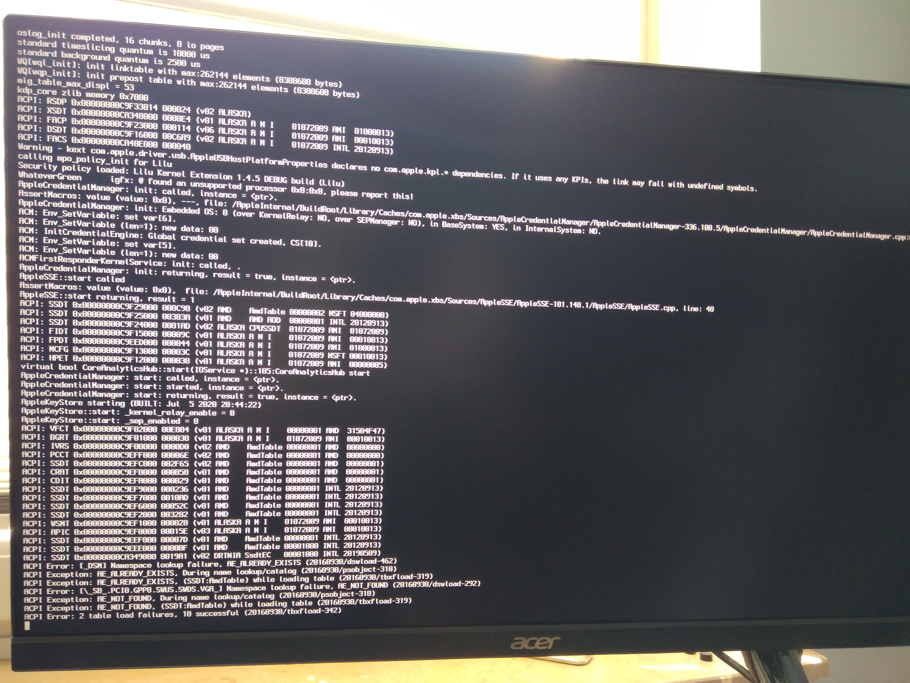

# Solución de problemas

* Versión soportada: 0.6.1

Esta sección es para aquellos que tienen problemas al iniciar OpenCore, macOS o que tienen problemas dentro de macOS. Si estás confundido acerca de dónde exactamente en el proceso de arranque de macOS estás atascado, leer la página [Proceso de arranque de macOS](../troubleshooting/boot.md) puede ayudar a aclarar tus dudas.

Si bien todavía es un trabajo en progreso, los usuarios de laptops que desean convertir una instalación de Clover existente pueden ver la [Conversión de Clover a OpenCore](https://github.com/dortania/OpenCore-Install-Guide/blob/master/clover-conversion) para más información

**Y si su problema no está cubierto, lee la documentación oficial de OpenCore: [Configuration.pdf](https://github.com/acidanthera/OpenCorePkg/blob/master/Docs/Configuration.pdf)**

# Arranque de OpenCore

* [Trancado en `no vault provided!`](#trancado-en-no-vault-provided)
* [Trancado en EndRandomSeed](#trancado-en-endrandomseed)
* [Trancado en `[EB|#LOG:EXITBS:START]`](#trancado-en-eblogexitbsstart)
* [Trancado en [EB|LD:OFS] Err(0xE) cuando arrancas desde el volumen preboot](#trancado-en-eb-ld-ofs-err-0xe-cuando-arrancas-desde-el-volumen-preboot)
* [No puedo ver particiones de macOS](#no-puedo-ver-particiones-de-macos)
* [Pantalla negra luego del picker](#pantalla-negra-luego-del-picker)
* [Trancado en `OC: OcAppleGenericInput... - Success`](#trancado-en-oc-ocapplegenericinput---success)
* [Trancado en `OCB: OcScanForBootEntries failure - Not Found`](#trancado-en-ocb-ocscanforbootentries-failure---not-found)
* [Trancado en `OCB: failed to match a default boot option`](#trancado-en-ocb-failed-to-match-a-default-boot-option)
* [Trancado en `OCABC: Memory pool allocation failure - Not Found`](#trancado-en-ocabc-memory-pool-allocation-failure---not-found)
* [Trancado en `OCS: No schema for DSDT, KernelAndKextPatch, RtVariable, SMBIOS, SystemParameters...`](#trancado-en-ocs-no-schema-for-dsdt-kernelandkextpatch-rtvariable-smbios-systemparameters)
* [Trancado en `OC: Driver XXX.efi at 0 cannot be found`](#trancado-en-oc-driver-xxxefi-at-0-cannot-be-found)
* [Trancado en `Buffer Too Small`](#trancado-en-buffer-too-small)
* [Trancado en `Plist only kext has CFBundleExecutable key`](#trancado-en-plist-only-kext-has-cfbundleexecutable-key)
* [Recibiendo `Failed to parse real field of type 1`](#recibiendo-failed-to-parse-real-field-of-type-1)
* [Trancado luego de la selección de la partición de macOS en OpenCore](#trancado-luego-de-la-selección-de-la-partición-de-macos-en-opencore)
* [No puedo seleccionar nada en el menú](#no-puedo-seleccionar-nada-en-el-menú)
* [Trancado en `This version of Mac OS X is not supported: Reason Mac...`](#trancado-en-this-version-of-mac-os-x-is-not-supported-reason-mac)
* [Errores `Couldn't allocate runtime area`](#errores-couldnt-allocate-runtime-area)
* [SSDTs no siendo agregados](#ssdts-no-siendo-agregados)
* [Bootear opencore reinicia a la BIOS](#bootear-opencore-reinicia-a-la-bios)
* [OCABC: Incompatible OpenRuntime r4, require r10](#ocabc-incompatible-openruntime-r4-require-r10)
* [Trancado en `OCB: LoadImage failed - Security Violation`](#trancado-en-ocb-loadimage-failed-security)

## Trancado en `no vault provided!`

Apaga el vaulting en tu config.plist debajo de `Misc -> Security -> Vault`, debes configurarlo a:

* `Optional`

Si ya has ejecutado el `sign.command`, deberás restaurar el archivo OpenCore.efi ya que se ha introducido la firma RSA-2048 de 256 bytes. Puedes obtener una nueva copia de OpenCore.efi aquí: [OpenCorePkg](https://github.com/acidanthera/OpenCorePkg/releases)

**Nota**: Vault y FileVault son 2 cosas distintas, consulta [Seguridad y FileVault](https://dortania.github.io/OpenCore-Post-Install/universal/security.html) para obtener más detalles.

## Trancado en `OC: Invalid Vault mode`

Es probable que sea un error ortográfico, las opciones en OpenCore distinguen entre mayúsculas y minúsculas, así que asegúrate de verificar detenidamente, **O**ptional es la forma correcta de ingresarlo en `Misc -> Security -> Vault`

## Trancado en EndRandomSeed

Algunos problemas:

**Problemas con Booter:**

* `DevirtualiseMmio` puede estar tomando áreas importantes en la memoria que son necesarias para otras cosas, puede que necesites deshabilitar este quirk o incluir en la lista blanca las regiones defectuosas: [Usando DevirtualiseMmio](../extras/kaslr-fix.md#using-devirtualisemmio)
* `SetupVirtualMap` puede ser necesario dependiendo del firmware, generalmente este quirk debe evitarse, pero la mayoría de los usuarios de Gigabyte y hardware antiguo (Broadwell y anterior) necesitarán esta peculiaridad para arrancar.
   * Se sabe que las placas madre Z490 fallan con `SetupVirtualMap` habilitado, especialmente en las placas Asus y AsRock.
* `RebuildAppleMemoryMap` puede no ser un fanático de tu firmware, y el uso de este quirk depende de tener `EnableWriteUnprotector` deshabilitado y `SyncRuntimePermissions` habilitado con la adición de tener una `Tabla de atributos de memoria (MAT)` en tu firmware. Si su firmware no tiene MATs, desactiva tanto `RebuildAppleMemoryMap` como `SyncRuntimePermissions` y luego habilita `EnableWriteUnprotector`.
  * Si tu firmware no tiene MATs:
    * Deshabilita ambos `RebuildAppleMemoryMap` y `SyncRuntimePermissions` y luego habilita `EnableWriteUnprotector`.
  * Si tu firmware soporta MATs:
    * Habilita tanto `RebuildAppleMemoryMap` como `SyncRuntimePermissions` y luego deshabilita `EnableWriteUnprotector`.

Para verificar si tu placa madre tiene MATs, busca algo así en los logs:

```
OCABC: MAT support is 1
```

**Problemas con Kernel:**

* **AMD:** Faltan los [parches del kernel](https://github.com/AMD-OSX/AMD_Vanilla/tree/opencore)(sólo aplica para CPUs de AMD, asegúrate que son parches de OpenCore y no de Clover. Clover usa `MatchOS` mientras que OpenCore tiene `MinKernel` y `Maxkernel`)
* **Intel:** Faltan parches de CFG or XCPM
  * Habilita `AppleXcpmCfgLock` y `AppleCpuPmCfgLock`, lo cual deshabilita `PKG_CST_CNFIG_CONTROL` en el XNU y AppleIntelCPUPowerManagement respectivamente. No es recomendado como una solución a largo plazo porque puede causar inestabilidad.
  * Alternativamente puedes deshabilitar el CFG Lock correctamente: [Arreglando CFG Lock](https://dortania.github.io/OpenCore-Post-Install/misc/msr-lock.html)
* **Intel:** `AppleXcpmExtraMsrs` puede ser necesario, generalmente para Pentiums, HEDT y otros sistemas que no están soportados nativamente en macOS. **No usar en AMD**
  
**UEFI Issues:**

* `ProvideConsoleGop` probablemente no está presente ya que es necesario para trancisionar a la próxima pantalla. Originalmente esto era parte de AptioMemoryFix pero ahora está fusionado dentro de OpenCore con este quirk. Puede ser encontrado en UEFI -> Output
* `IgnoreInvalidFlexRatio` falta, esto es necesario para Broadwell y anteriores. **No para AMD o para Skylake y posterior**

## Trancado en `[EB|#LOG:EXITBS:START]`

Esto es en realidad el mismo error que `EndRandomSeed` así que aplican los mismos arreglos (10.15.4 y posterior cambiaron el protocolo del debug por si eres curioso):

**Problemas con Booter:**

* `RebuildAppleMemoryMap` puede no ser un fanático de tu firmware, y el uso de este quirk depende de tener `EnableWriteUnprotector` deshabilitado y `SyncRuntimePermissions` habilitado con la adición de tener una `Tabla de atributos de memoria (MAT)` en tu firmware. Si su firmware no tiene MATs, desactiva tanto `RebuildAppleMemoryMap` como `SyncRuntimePermissions` y luego habilita `EnableWriteUnprotector`.

Para verificar si tu placa madre tiene MATs, busca algo así en los logs:

```
OCABC: MAT support is 1
```
* `DevirtualiseMmio`
  * Algunos espacios MMIO siguen siendo requeridos para funcionar correctamente, por lo que tendrás que excluir estas regiones en Booter -> MmioWhitelist o deshabilitar este quirk por completo.or disable this quirk outright.
  * Más información aquí: [Usando DevirtualiseMmio](../extras/kaslr-fix.md#using-devirtualisemmio)

* `SetupVirtualMap`
  * Este quirk es requerido por la mayoría de los firmwares y sin este es muy común ver un pánico del kernel aquí, así que habilítalo si no lo has hecho aún.
    * Sin embargo, ciertos firmwares no funcionan con este quirk y este quirk podría ser el causante del kernel panic:
      * La serie Ice Lake de Intel
      * La serie Comet Lake de Intel
      * Las placas madre B550 y A520 de AMD 
      * Placas madre TRx40 de AMD
      * Máquinas virtuales como QEMU
      * Actualizaciónes de la BIOS 3006+ en las placas X299 de ASUS (esto también aplica a otras BIOS X299 en la BIOS más reciente).

* `EnableWriteUnprotector`

  * Otro problema puede ser que macOS está teniendo conflictos con la protección de escritura del registro CR0. Para resolver esto tenemos dos opciones:
    * Si tu firmware soporta MATs (firmwares de 2018+):
      * EnableWriteUnprotector -> False
      * RebuildAppleMemoryMap -> True
      * SyncRuntimePermissions -> True
    * Para firmwares más antiguos:
      * EnableWriteUnprotector -> True
      * RebuildAppleMemoryMap -> False
      * SyncRuntimePermissions -> False
      
Con respecto al soporte de MATs, los firmwares construidos luego de EDK 2018 lo soportarán y muchos fabricantes incluso han agregado soporte desde las laptops Skylake. El problema es que no siempre es fácil saber si un fabricante ha actualizado el firmware, puedes verificar los registros de OpenCore para saber si el tuyo lo admite:

```
OCABC: MAT support is 1
```

Nota: `1` significa que soporta MATs, mientras que `0` significa que no.


**Problemas con Kernel:**

* **AMD:** 
* **Intel:** Faltan parches de CFG or XCPM
  * Habilita `AppleXcpmCfgLock` y `AppleCpuPmCfgLock`, lo cual deshabilita `PKG_CST_CNFIG_CONTROL` en el XNU y AppleIntelCPUPowerManagement respectivamente. No es recomendado como una solución a largo plazo porque puede causar inestabilidad.
  * Alternativamente puedes deshabilitar el CFG Lock correctamente: [Arreglando CFG Lock](https://dortania.github.io/OpenCore-Post-Install/misc/msr-lock.html)
* **Intel:** `AppleXcpmExtraMsrs` puede ser necesario, generalmente para Pentiums, HEDT y otros sistemas que no están soportados nativamente en macOS. **No usar en AMD**
  
**UEFI Issues:**

* `ProvideConsoleGop` probablemente no está presente ya que es necesario para trancisionar a la próxima pantalla. Originalmente esto era parte de AptioMemoryFix pero ahora está fusionado dentro de OpenCore con este quirk. Puede ser encontrado en UEFI -> Output
* `IgnoreInvalidFlexRatio` falta, esto es necesario para Broadwell y anteriores. **No para AMD o para Skylake y posterior**

## Trancado en [EB|LD:OFS] Err(0xE) cuando arrancas desde el volumen preboot

Esto puede suceder cuando el volumen preboot no está actualizado correctamente, para arreglar esto necesitarás bootear a recovery y repararlo:

1. Habilita JumpstartHotplug en UEFI -> APFS (Recovery podría no arrancar en macOS Big Sur sin esta opción)
2. Bootea a recovery
3. Abre la terminal y corre lo siguiente:

```bash
# Primero, encuentra tu volumen Preboot
diskutil list

# Desde la siguiente lista podemos ver que nuestro volument preboot es disk5s2
/dev/disk5 (synthesized):
   #:                       TYPE NAME                    SIZE       IDENTIFIER
   0:      APFS Container Scheme -                      +255.7 GB   disk5
                                 Physical Store disk4s2
   1:                APFS Volume ⁨Big Sur HD - Data⁩       122.5 GB   disk5s1
   2:                APFS Volume ⁨Preboot⁩                 309.4 MB   disk5s2
   3:                APFS Volume ⁨Recovery⁩                887.8 MB   disk5s3
   4:                APFS Volume ⁨VM⁩                      1.1 MB     disk5s4
   5:                APFS Volume ⁨Big Sur HD⁩              16.2 GB    disk5s5
   6:              APFS Snapshot ⁨com.apple.os.update-...⁩ 16.2 GB    disk5s5s

# ahora monta el volumen preboot
diskutil mount disk5s2

# Luego corre updatePreboot en el volumen Preboot
diskutil apfs updatePreboot /volume/disk5s2
```

Luego finalmente reinicia, aunque podrías tener que deshabilitar JumpstartHotplug para arrancar normalmente de nuevo.

## Trancado en `OCB: LoadImage failed - Security Violation`

```
OCSB: No suitable signature - Security Violation
OCB: Apple Secure Boot prohibits this boot entry, enforcing!
OCB: LoadImage failed - Security Violation
```

Esto es debido a manifiestos de modo seguro de Apple antiguados faltantes en tu volumen preboot, lo que hace que falle en cargar si tienes SecureBootModel configurado. La razón de la falta de estos archivos es en realidad un bug en macOS.

Para resolver esto puedes hacer alguna de las siguientes cosas:

* Deshabilitar SecureBootModel (es decir, configurar `Misc -> Secuirty -> SecureBootModel -> Disabled`)
* Reinstalar macOS con la última versión
* O copiar los manifestos del Modo Seguro de `/usr/standalone/i386` a `/Volumes/Preboot/<UUID>/System/Library/CoreServices`

## No puedo ver particiones de macOS

Cosas principales a verificar:

* ScanPolicy configurado a `0` para mostrar todos los discos
* Tener los drivers del firmware correctos como HfsPlus (ten en cuenta que no deberías usar ApfsDriverLoader desde 0.5.8)
* Configurar UnblockFsConnect a True en tu config.plist -> UEFI -> Quirks. Necesario por algunos sistemas HP
* Configura `UEFI -> APFS` para ver discos basados en APFS:
  * **EnableJumpstart**: YES
  * **HideVerbose**: YES
  * **MinDate**: `-1`
  * **MinVersion**: `-1`

## Pantalla negra luego de el menú

Esto es debido a la falta de ConsoleGOP, habilítalo en tu config:

* `UEFI -> Output -> ProvideConsoleGop`

Otra posibilidad es que el problema sea porque `RebuildAppleMemoryMap` está habilitado, así que deshabilitalo en tu config:

* `Booter -> Quirks -> RebuildAppleMemoryMap`

Si esto no ayuda, toma las [versiones debug](https://github.com/acidanthera/OpenCorePkg/releases) de `OpenCore.efi` y `BOOTx64.efi` y reemplázalas en su EFI. Esto mostrará mucha más información sobre dónde se está atascando tu hack.

## Trancado en `OC: OcAppleGenericInput... - Success`

Esto en realidad no es un error, es en realidad que OpenCore no te está mostrando toda la información de depuración. Esto es antes/mientras se está cargando el kernel así que tenemos que verificar que:

* Intel:
  * CFG-Lock deshabilitado en la BIOS **o** `AppleCpuPmCfgLock` y `AppleCpuPmCfgLock` habilitados en Kernel -> Quirks (si puedes es mejor que deshabilites CFG lock desde la BIOS, pero muchos no tienen la opción de hacer esto)
* AMD:
  * Verifica que tienes los parches del kernel correctos en tu config (recuerda que OpenCore usa `MinKernel` y `MaxKernel` mientras que Clover usa `MatchOS`)
    * [Ryzen/Threadripper(17h)](https://github.com/AMD-OSX/AMD_Vanilla/tree/opencore/17h)
    * [Bulldozer/Jaguar(15h/16h)](https://github.com/AMD-OSX/AMD_Vanilla/tree/opencore/15h_16h)

Si esto no ayuda, toma las [versiones debug](https://github.com/acidanthera/OpenCorePkg/releases) de `OpenCore.efi` y `BOOTx64.efi` y reemplázalas en su EFI. Esto mostrará mucha más información sobre dónde se está atascando tu hack.

## Trancado en `OCB: OcScanForBootEntries failure - Not Found`

Esto es debido a que OpenCore no puede encontrar ningún disco con tu ScanPolicy actual, configurándolo a `0` permite que se muestren todas las opciones de arranque

* `Misc -> Security -> ScanPolicy -> 0`

## Trancado en `OCB: failed to match a default boot option`


El mismo arreglo que `OCB: OcScanForBootEntries failure - Not Found`, OpenCore no puede encontrar ningún disco con el ScanPolicy actual, la configuración a` 0` permitirá mostrar todas las opciones de arranque

* `Misc -> Security -> ScanPolicy -> 0`

## Trancado en `OCABC: Memory pool allocation failure - Not Found`

Esto se debe a configuraciones incorrectas del BIOS y/o valores incorrectos del Booter. Asegúrate de que config.plist -> Booter -> Quirks sea correcto y verifica la configuración de tu BIOS:

* Above 4G Decoding está habilitado
* CSM está deshabilitado (Habilitar el modo WHQL de Windows8.1/10 puede hacer lo mismo en algunas placas madre)
* Que tu BIOS está actualizado (Z390 y HEDT son conocidos por tener firmware mal escrito)

## Trancado en `OCS: No schema for DSDT, KernelAndKextPatch, RtVariable, SMBIOS, SystemParameters...`

Esto es debido a que, o estás usando un config de Clover o estás usando un configurador como OpenCore y Clover configurator de Mackie. Necesitarás comenzar de nuevo y hacer un config nuevo o intentar darte cuenta toda la basura que tienes que eliminar de tu config. **Esto es por lo que no soportamos configuradores, son conocidos por estos errores**

## Trancado en `OC: Driver XXX.efi at 0 cannot be found`

Verifica que lo que tienes en EFI/OC/Drivers también está en tu config.plist -> UEFI -> Drivers

Ten en cuenta que las entradas distinguen entre mayúsculas y minúsculas

## Trancado en `Buffer Too Small`

* Habilita Above 4G Decoding en tu BIOS

## Trancado en `Plist only kext has CFBundleExecutable key`

`Executable path` falta o es incorrecto

## Recibiendo "Failed to parse real field of type 1"

* Un valor que fue configurado a `real` cuando no debería serlo, esto generalmente es cuando Xcode convierte  `HaltLevel` por accidente:

  ```
  <key>HaltLevel</key>
  ```

  ```
  <real>2147483648</real>
  ```

  Para arreglar esto, cambia `real` por `integer`:

  ```
  <key>HaltLevel</key>
  ```

  ```
  <integer>2147483648</integer>
  ```
  
## Trancado luego de la selección de la partición de macOS en OpenCore

* CFG-Lock no está deshabilitado (Sólo para usuarios de Intel). Estas son algunas soluciones:
  * [Parchear tu MSR E2](https://dortania.github.io/OpenCore-Post-Install/misc/msr-lock.html)(Solución recomendada)
  * Habilita `AppleXcpmCfgLock` y `AppleCpuPmCfgLock`, lo cual deshabilita `PKG_CST_CNFIG_CONTROL` en el XNU y AppleIntelCPUPowerManagement respectivamente. No es recomendado como una solución a largo plazo porque puede causar inestabilidad.
* Parches del kernel AMD no están funcionando (sólo para usuarios AMD):
  * Parches faltantes o desactualizados
* Driver de teclado incompatible:
  * Deshabilita `PollAppleHotKeys` y habilita `KeySupport`, luego elimina [OpenUsbKbDxe](https://github.com/acidanthera/OpenCorePkg/releases) de tu config.plist -> UEFI -> Drivers
  * Si lo anterior no funciona, haz lo contrario: deshabilita `KeySupport`, luego agrega [OpenUsbKbDxe](https://github.com/acidanthera/OpenCorePkg/releases) a tu config.plist -> UEFI -> Drivers

## No puedo seleccionar nada en el menú de OpenCore

  * Deshabilita `PollAppleHotKeys` y habilita `KeySupport`, luego elimina [OpenUsbKbDxe](https://github.com/acidanthera/OpenCorePkg/releases) de tu config.plist -> UEFI -> Drivers
  * Si lo anterior no funciona, haz lo contrario: deshabilita `KeySupport`, luego agrega [OpenUsbKbDxe](https://github.com/acidanthera/OpenCorePkg/releases) a tu config.plist -> UEFI -> Drivers

## Trancado en `This version of Mac OS X is not supported: Reason Mac...`

Este error para cuando tu SMBIOS no está soportada por esa versión de macOS. Asegúrate que tus valores de SMBIOS están configuradas en `PlatformInfo->Generic` con `Automatic` habilitado. Recordatorio de SMBIOS soportadas en macOS 10.15 Catalina:

* iMac13,x+
* iMacPro1,1
* MacPro6,1+
* MacBook8,1+
* MacBookAir5,x+
* MacBookPro9,x+

Otro recordatorio, las siguientes SMBIOS requieren versiones más nuevas de macOS:

| SMBIOS | Soporte Inicial | Soporte del Kernel |
| :--- | :--- | :--- |
| iMac19,x       | 10.14.4  | 18E226 |
| iMac20,x       | 10.15.6  | 19G2005 |
| MacPro7,1      | 10.15.0  | 19A583 |
| MacBookAir9,1  | 10.15.4  | 19E287 |
| MacBookPro16,1 | 10.15.1  | 19B2093 |
| MacBookPro16,2 | 10.15.4  | 19E2269 |
| MacBookPro16,3 | 10.15.4  | 19E2269 |

## Errores de `Couldn't allocate runtime area` 

Mira [Arreglando valores slide de KASLR](../extras/kaslr-fix.md)

## SSDTs no siendo agregados

Con OpenCore, hay algunas comprobaciones de seguridad adicionales agregadas alrededor de los archivos ACPI, específicamente que el encabezado de la longitud de la tabla debe ser igual al tamaño del archivo. Esto es culpa de iASL cuando compiló el archivo. Ejemplo de cómo encontrarlo:

```
* Original Table Header:
*     Signature        "SSDT"
*     Length           0x0000015D (349)
*     Revision         0x02
*     Checksum         0xCF
*     OEM ID           "ACDT"
*     OEM Table ID     "SsdtEC"
*     OEM Revision     0x00001000 (4096)
*     Compiler ID      "INTL"
*     Compiler Version 0x20190509 (538510601)
```


El valor de `Length` y `checksum` es lo que nos importa, por lo que si nuestro SSDT es de 347 bytes, entonces queremos cambiar `Length` a `0x0000015B (347) `(el` 015B` está en HEX)

La mejor manera de arreglar esto es tomar una copia más reciente de iASL o la copia de Acidanthera de [MaciASL](https://github.com/acidanthera/MaciASL/releases) y rehacer el SSDT


## Arrancando OpenCore reinicia a la BIOS

* Estructura de carpetas EFI incorrecta, asegúrate de que todos tus archivos OC estén dentro de una carpeta EFI ubicada en su ESP (partición del sistema EFI)

 

## OCABC: Incompatible OpenRuntime r4, require r10

OpenRuntime.efi desactualizado, asegúrate de que BOOTx64.efi, OpenCore.efi y OpenRuntime son **todos de la misma versión**. Cualquier cosa que no coincida interrumpirá el arranque

* **Nota**: FwRuntimeServices ha cambiado su nombre a OpenRuntime con 0.5.7 y más reciente

# Booteo de macOS

* [Trancado en `RTC...`, `PCI ConfigurationBegins`, `Previous Shutdown...`, `HPET`, `HID: Legacy...`](#trancado-en-rtc-pci-configuration-begins-previous-shutdown-hpet-hid-legacy)
* [Trancado en ACPI Table loading en B550](#trancado-en-acpi-table-loading-on-b550)
* ["Waiting for Root Device" o signo de prohibido](#waiting-for-root-device-o-signo-de-prohibido)
* [Instalador de macOS en ruso](#instalador-de-macos-en-ruso)
* [Instalador de macOS dañado](#instalador-de-macos-dañado)
* [Trancado en o cerca de `IOConsoleUsers: gIOScreenLock...`](#trancado-en-o-cerca-de-ioconsoleusers-gioscreenlockgiolockstate-3)
* [Pantalla revuelta y perturbada en laptops](#pantalla-revuelta-y-perturbada-en-laptops)
* [Pantalla negra luego de `IOConsoleUsers: gIOScreenLock...` en Navi](#pantalla-negra-luego-de-ioconsoleusers-gioscreenlock-en-navi)
* [Intel de serie 300 trancados en `apfs_module_start...`](#intel-de-serie-300-trancados-en-apfsmodulestart)
* [Kernel Panic `Cannot perform kext summary`](#kernel-panic-cannot-perform-kext-summary)
* [Kernel Panic `AppleIntelMCEReporter`](#kernel-panic-appleintelmcereporter)
* [Kernel Panic `AppleIntelCPUPowerManagement`](#kernel-panic-appleintelcpupowermanagement)
* [Trancado en el instalador de macOS luego de 30 segundos](#trancado-en-el-instalador-de-macos-luego-de-30-segundos)
* [15h/16h CPU reinicio luego de pantalla de datos y privacidad](#15h16h-cpu-reinicio-luego-de-la-pantalla-de-datos-y-privacidad)
* [Teclado funciona pero el trackpad no](#teclado-funciona-pero-el-trackpad-no)
* [Suspensión crasheando en AMD](#suspensión-crasheando-en-amd)
* [Kernel Panic en `Invalid frame pointer`](#kernel-panic-en-invalid-frame-pointer)
* [`kextd stall[0]: AppleACPICPU`](#kextd-stall0-appleacpicpu)
* [MediaKit reporta que no hay espacio suficiente](#mediakit-reporta-que-no-hay-espacio-suficiente)
* [DiskUtility error al eliminar](#diskutility-error-al-eliminar)
* [Kernel Panic en AppleIntelI210Ethernet](appleinteli210ethernet)
* [Discos SATA no aparecen en Disk Utility](#discos-sata-no-aparecen-en-disk-utility)
* [Trancado cuando faltan 2 minutos](#trancado-cuando-faltan-2-minutos)
[Kernel panic en "Wrong CD Clock Frequency" con laptops Icelake](#kernel-panic-en-wrong-cd-clock-frequency-con-laptops-icelake)

## Stuck on `RTC...`, `PCI Configuration Begins`, `Previous Shutdown...`, `HPET`, `HID: Legacy...`

Esta área en general es cuando muchos dispositivos PCI son configurados y preparados por primera vez y aquí es cuando la mayoría de los errores sucederán. Otros nombres pueden incluir:

* `apfs_module_start...`,
* `Waiting for Root device`,
* `Waiting on...IOResources...`,
* `previous shutdown cause...`

Lugares principales a revisar:


* **Falta parche de EC**:
  * Para computadoras de escritorio, asegúrate de tener tu SSDT de EC tanto en EFI/OC/ACPI como en ACPI -> Add, **verifica que esté habilitado.**
  * Si no tienes uno, consíguelo aquí: [Introducción a ACPI](https://dortania.github.io/Getting-Started-With-ACPI/)
* **Conflicto IRQ**:
  * Común en las computadoras portátiles y computadoras prehechas antiguas, ejecuta la opción FixHPET de SSDTTime y agrega los parches SSDT-HPET.aml y ACPI resultantes a tu configuración (el SSDT no funcionará sin los parches ACPI)
* **Problema de asignación de PCI**:
  * **ACTUALIZA TU BIOS**, asegúrate de que esté actualizado. La mayoría de los OEM tienen una asignación de PCI rota en firmwares antiguos, especialmente en AMD
  * Asegúrate de que Above 4G decoding esté habilitado en el BIOS, si no hay una opción disponible, agrega `npci = 0x2000` a los boot args.
    * Nota de CPUs AMD: **No tengas habilitada la configuración Above 4G y npci en los argumentos de arranque, entrarán en conflicto**. Esta regla no se aplica a X99
  * Otras configuraciones de BIOS que son importantes: CSM deshabilitado, Windows 8.1 / 10 Modo UEFI habilitado

* **Problemas NVMe o SATA**:
  * A veces, si se utiliza un controlador SATA defectuoso o una unidad NVMe no compatible, normalmente puede quedarse atascado aquí. Cosas que puedes consultar:
    * No estás usando una unidad de estado sólido Samsung PM981 o Micron 2200S NVMe
    * Samsung 970 Evo Plus con el último firmware (los firmwares más antiguos eran conocidos por la inestabilidad y los bloqueos, [consulta aquí para obtener más información](https://www.samsung.com/semiconductor/minisite/ssd/download/tools/))
    * SATA HotPlug está deshabilitado en la BIOS (causa problemas más comunmente en sistemas basados ​​en CPUs AMD)
    * Asegúrate de que las unidades NVMe estén configuradas como modo NVMe en la BIOS (algunas BIOS tienen un error en el que puede configurar las unidades NVMe como SATA)
* **Falla de NVRAM**:
  * Problema común en placas madre HEDT y de la serie 300, tienes un par de caminos para seguir:
    * Series 300 de Intel: Consulta [Introducción a ACPI](https://dortania.github.io/Getting-Started-With-ACPI/) sobre cómo hacer SSDT-PMC.aml
    * HEDT: Consulta [Emulación de NVRAM](https://dortania.github.io/OpenCore-Post-Install/misc/nvram.html) sobre cómo detener la escritura de NVRAM, ten en cuenta que para la instalación no necesitas ejecutar el script. Simplemente configura tu config.plist

* **Falta RTC**:
   * Comúnmente encontrado en la serie 300 y las placas madre X299/Cascade Lake-X refresh, debido a que el reloj RTC está deshabilitado de forma predeterminada. Consulta [Introducción a ACPI](https://dortania.github.io/Getting-Started-With-ACPI/) sobre cómo crear un SSDT-AWAC.aml
   * Algunos firmwares de HP también deshabilitaron el RTC en el HP 250 G6 sin ninguna forma de volver a habilitarlo realmente, los usuarios maldecidos con dicho hardware necesitarán crear un reloj RTC falso para que macOS juegue:

Ejemplo de cómo se ve un RTC deshabilitado sin forma de habilitarlo (ten en cuenta que no hay ningún valor para volver a habilitarlo como `STAS`):


## Trancado en ACPI Table loading en B550



Si te estás quedando trancado en/cerca de ACPI table loading con un motherboard AMD B550 o A520, agrega el siguiente SSDT:

* [SSDT-CPUR.aml](https://github.com/dortania/Getting-Started-With-ACPI/blob/master/extra-files/compiled/SSDT-CPUR.aml)

Y por favor recuerda agregarlo a ambos EFI/OC/ACPI **y** tu config.plist debajo de ACPI -> Add (La función snapshot de ProperTree puede hacer esto por tí)

## "Waiting for Root Device" o signo de prohibido

Generalmente visto como un error de USB, hay dos formas de arreglarlo:

* Si estás alcanzando el límite de 15 puertos, puedes evitar esto temporalmente con `XhciPortLimit` pero para uso a largo plazo, te recomendamos que hagas un [USB map](https://github.com/corpnewt/USBMap). CorpNewt también tiene una guía para esto: [Guía de USBmap](https://dortania.github.io/OpenCore-Post-Install/usb/)
* Otro problema puede ser que ciertos firmwares no pasarán las propiedades de USBs a macOS, para solucionar esto podemos habilitar `UEFI -> Quirks -> ReleaseUsbOwnership` en tu config.plist
  * Habilitar XHCI Handoff en el BIOS también puede solucionar esto
* Para las CPU AMD de 15h y 16h, es posible que debas agregar lo siguiente:
  * [XLNCUSBFix.kext](https://cdn.discordapp.com/attachments/566705665616117760/566728101292408877/XLNCUSBFix.kext.zip)
* Si XLNCUSBFix aún no funciona, intenta lo siguiente:
  * [AMD StopSign-fixv5](https://cdn.discordapp.com/attachments/249992304503291905/355235241645965312/StopSign-fixv5.zip)
  
Otro posible problema es la falta de puertos USB en tu DSDT, macOS no es excelente para encontrar hardware y necesita propiedades explícitamente definidas para muchas cosas. Esto significa que si un puerto USB no está definido, macOS no podrá encontrarlo. Para solucionar esto, utilizamos [USBInjectAll](https://github.com/Sniki/OS-X-USB-Inject-All/releases) para corregir el arranque, ten en cuenta que esto **solo funciona en los chipsets USB de Intel** y debería requerirse en Broadwell y sistemas más antiguos (con algunas placas AsRock más nuevas que también lo necesitan)

Los usuarios de AMD con puertos faltantes en su DSDT, tendrán que probar todos los puertos en su sistema y rezar, generalmente los puertos 3.1  AsMedia funcionan sin problemas.

En raras ocasiones (principalmente en laptops), el controlador SATA no es oficialmente compatible con macOS. Para resolver esto, queremos hacer algunas cosas:

* Establecer SATA en modo AHCI en el BIOS
  * macOS no admite el modo RAID o IDE de hardware correctamente.
  * Ten en cuenta que las unidades que ya utilizan la tecnología Intel Rapid Storage (RST, soft RAID para Windows y Linux) no serán accesibles en macOS.
* [SATA-unsupported.kext] (https://github.com/RehabMan/hack-tools/tree/master/kexts/SATA-unsupported.kext)
  * Agrega soporte para controladores SATA no soportados, comúnmente en laptops.
  * Para controladores SATA muy antiguos, [AHCIPortInjector.kext] (https://www.insanelymac.com/forum/files/file/436-ahciportinjectorkext/) puede ser más adecuado.

Ten en cuenta que solo experimentarás este problema después de instalar macOS en la unidad, al iniciar el instalador de macOS no se producirá un error debido a problemas de SATA.

## instalador de macOS en ruso

La configuración del sample predeterminada está en ruso porque los Slavs gobiernan el mundo de los Hackintoshes, verifica tu valor `prev-lang: kbd` en` NVRAM -> Add -> 7C436110-AB2A-4BBB-A880-FE41995C9F82`. Se establece a `656e2d55533a30` para Inglés de EEUU: en-US: 0 y se puede encontrar una lista completa en [AppleKeyboardLayouts.txt](https://github.com/acidanthera/OpenCorePkg/blob/master/Utilities/AppleKeyboardLayouts/AppleKeyboardLayouts.txt ) Para aquellos que usan un editor de texto simple (es decir, UEFI Shell, Notepad++, etc.), `656e2d55533a30` se convertirá a `ZW4tVVM6MA==`

Default sample config is in Russian because slavs rule the Hackintosh world, check your `prev-lang:kbd` value under `NVRAM -> Add -> 7C436110-AB2A-4BBB-A880-FE41995C9F82`. Set to `656e2d55533a30` for American: en-US:0 and a full list can be found in [AppleKeyboardLayouts.txt](https://github.com/acidanthera/OpenCorePkg/blob/master/Utilities/AppleKeyboardLayouts/AppleKeyboardLayouts.txt). For those using with a simple text editor(ie. UEFI Shell, Notepad++, etc), `656e2d55533a30` will become `ZW4tVVM6MA==`

Es posible que también debas restablecer la NVRAM en el selector de arranque

¿Aún no funcionó? Bueno, tiempo para las armas pesadas. Forzaremos la eliminación de esa propiedad exacta y dejaremos que OpenCore la reconstruya:

`NVRAM -> Block -> 7C436110-AB2A-4BBB-A880-FE41995C9F82 -> Item 0` luego configura el tipo a `String` y el valor `prev-lang:kbd`


## Instalador de macOS dañado

Si ha descargado macOS antes de Octubre de 2019, es probable que tenga un certificado de instalador de macOS vencido, hay 2 formas de solucionar esto:

* Descargar la copia más reciente de macOS
* Cambiar la fecha en la terminal a cuando el certificado era válido

Para ese último:

* Desconecta todos los dispositivos de red (Ethernet, deshabilita el Wifi)
* En el terminal del recovery establece la fecha al 1 de septiembre de 2019:

```
date 0901000019
```

## Trancado en o cerca de `IOConsoleUsers: gIOScreenLock...`/`gIOLockState (3...`

Esto es justo antes de que la GPU es inicializada, verifica lo siguiente:

* Que tu GPU este capacitada para UEFI (GTX 7XX/2013+)
* CSM está desactivado en la BIOS
* Estás forzando el link speed de PCIe a 3.0
* Verifica que el ig-platform-id y device-id son válidos si estás corriendo con tu iGPU.
  * UHD 630s de escritorio pueden llegar a necesitar `00009B3E`
* Prueba [arreglos de WhateverGreen](https://github.com/acidanthera/WhateverGreen/blob/master/Manual/FAQ.IntelHD.en.md)
  * El boot arg `-igfxmlr`. Esto también se puede manifestar como el error de "división entre cero".
* Usuarios de iGPU Coffee Lake pueden necesitar `igfxonln=1` en 10.15.4 y posterior

## Pantalla revuelta y perturbada en laptops

Habilita CSM en tus ajustes UEFI. Esto también puede aparecer como"Boot legacy ROMs" u otro ajuste legacy.

## Pantalla negra luego de `IOConsoleUsers: gIOScreenLock...` en Navi

* Agrega `agdpmod=pikera` a tus boot args
* Cambia de conector de monitor en tu GPU
* Intenta arrancar con el SMBIOS MacPro7,1 y el boot arg `agdpmod=ignore`

Para usuarios Navi MSI, necesitarán aplicar el parche mencionado aquí: [Instalador no funcionando con 5700XT #901](https://github.com/acidanthera/bugtracker/issues/901)

Específicamente, agregando lo siguiente debajo de `Kernel -> Patch`:

```
Base:
Comment: Navi VBIOS Bug Patch
Count: 1
Enabled: YES
Find: 4154592C526F6D2300
Identifier: com.apple.kext.AMDRadeonX6000Framebuffer
Limit: 0
Mask:
MinKernel:
MaxKernel:
Replace: 414D442C526F6D2300
ReplaceMask:
Skip: 0
```

## 300 series Intel stalling on `apfs_module_start...`

Comúnmente siendo por sistemas que corren relojes AWAC, dirígete a la sección [Comenzando con ACPI](https://dortania.github.io/Getting-Started-With-ACPI/) section

## Kernel Panic `Cannot perform kext summary`

Generalmente visto como un problema que rodea al prelinked kernel, específicamente que macOS está teniendo dificultades para interpretar los que inyectamos. Verifica que:

* Que tus kexts estén en el orden correcto (el kext principal y luego los complementos, Lilu siempre es el primero)
* Que los kexts con ejecutables los tienen y que los kexts de sólo plist kexts no (kexts como USBmap.kext, XHCI-unspported.kext, etc no continenen un ejecutable).
* No incluyas múltiples kexts iguales en tu config.plist (por ejemplo si incluyes varias copias de VoodooInput de múltiples kexts, recomendamos elegir el primer kext en la formación de tu config y deshabilitar el resto.

## Kernel Panic `AppleIntelMCEReporter`

Con macOS Catalina, el soporte de doble socket está roto, y un dato curioso sobre el firmware de AMD es que algunas placas informarán en realidad múltiples CPU enchufadas. Para solucionar esto, agrega [AppleMCEReporterDisabler](https://github.com/acidanthera/bugtracker/files/3703498/AppleMCEReporterDisabler.kext.zip) a EFI/OC/Kexts y config.plist -> Kernel -> Add

## Kernel Panic `AppleIntelCPUPowerManagement`

Esto probablemente se deba a que NullCPUPowerManagement no está presente o no funciona, el que está alojado en la Guía Vanilla de AMD OSX está dañado. Ve a gritarle a Shannee para que lo arregle. Para solucionar el problema, elimina NullCPUPowerManagement de `Kernel -> Add` y` EFI/OC/Kexts` y luego habilita `DummyPowerManagement` en` Kernel -> Quirks`

## Frozen in the macOS installer after 30 seconds

Esto probablemente se deba a que NullCPUPowerManagement no está presente o no funciona, el que está alojado en la Guía Vanilla de AMD OSX está dañado. Ve a gritarle a Shannee para que lo arregle. Para solucionar el problema, elimina NullCPUPowerManagement de `Kernel -> Add` y` EFI/OC/Kexts` y luego habilita `DummyPowerManagement` en` Kernel -> Quirks`

## 15h/16h CPU reboot after Data & Privacy screen

Sigue las instrucciones aquí luego de UPDATE 2: [Arreglar reinicio en data y privacidad](https://www.insanelymac.com/forum/topic/335877-amd-mojave-kernel-development-and-testing/?do=findComment&comment=2658085)

## macOS congelado just antes del loggueo

Este es un ejemplo común de TSC malo, para la mayoría de los sistemas agrega [CpuTscSync](https://github.com/lvs1974/CpuTscSync)

En Skylake-X, muchos firmwares, incluidos Asus y EVGA, no escribirán el TSC en todos los núcleos, por lo que tendremos que restablecer el TSC en el arranque en frío y en la reactivación luego de suspender el PC. La versión compilada se puede encontrar aquí: [TSCAdjustReset.kext](https://github.com/dortania/OpenCore-Install-Guide/blob/master/extra-files/TSCAdjustReset.kext.zip). Ten en cuenta que  **debes** abrir el kext (Mostrar contenidos del paquete en Finder, `Contents -> Info.plist`) y cambiar el Info.plist -> `IOKitPersonalities -> IOPropertyMatch -> IOCPUNumber` a la cantidad de hilos de CPU que tener desde `0` (por ejemplo, el i9 7980xe, que tiene 18 núcleos sería `36`,  ya que tiene 36 hilos en total)

La manera más común de ver el problema del TSC:

Caso 1    |  Caso 2
:-------------------------:|:-------------------------:
  |  

## El teclado funciona pero el trackpad no

Asegúrate de que VoodooInput está listado *antes* que VoodooPS2 y VoodooI2C en tu config.plist.

### Solución de problemas con VoodooI2C

Fíjate en el orden de la carga de tus kexts, asegúrate que el orden coincide con lo mostrado en [Recolectando archivos Files](../ktext.md):

1. VoodooGPIO, VoodooInput, and VoodooI2CServices en cualquier orden (Encontrado en VoodooI2C.kext/Contents/PlugIns)
2. VoodooI2C
3. Satellite/Plugin Kext

Asegurate de que tienes SSDT-GPIO en EFI/OC/ACPI y en tu config.plist debajo de ACPI -> Add. Si sigues teniendo problemas, consulta la página de [Comenzando con ACPI GPIO](https://dortania.github.io/Getting-Started-With-ACPI/Laptops/trackpad.html).

## Kernel Panic en `Invalid frame pointer`

Esto se debe a algún problema relacionado con  `Booter -> Quirks` que configuraste, los principales aspectos a verificar:

* `DevirtualiseMmio`
  * Todavía se requieren ciertos espacios MMIO para funcionar correctamente, por lo que deberás excluir estas regiones en Booter -> MmioWhitelist o deshabilitar este quirk por completo
 * Más información aquí: [Usando DevirtualiseMmio](../extras/kaslr-fix.md#using-devirtualisemmio)

* `SetupVirtualMap`
  * Este quirk es requerido por la mayoría de los firmwares y sin este es muy común ver un pánico del kernel aquí, así que habilítalo si no lo has hecho aún.
    * Sin embargo, ciertos firmwares no funcionan con este quirk y este quirk podría ser el causante del kernel panic:
      * La serie Ice Lake de Intel
      * La serie Comet Lake de Intel
      * Las placas madre B550 y A520 de AMD
      * Placas madre TRx40 de AMD
      * Máquinas virtuales como QEMU

  
Otro problema puede ser que macOS está en conflicto con la protección contra escritura del registro CR0, para resolver esto tenemos 2 opciones:

* Si tu firmware es compatible con MATs (firmware de 2018+):
  * EnableWriteUnprotector -> False
  * RebuildAppleMemoryMap -> True
  * SyncRuntimePermissions -> True
* Para firmwares más antiguos:
  * EnableWriteUnprotector -> True
  * RebuildAppleMemoryMap -> False
  * SyncRuntimePermissions -> False

Con respecto al soporte de MAT, los firmwares construidos luego de EDK 2018 lo respaldarán y muchos OEM incluso han agregado soporte desde las laptops Skylake. El problema es que no siempre es fácil saber si un OEM ha actualizado el firmware, puedes verificar los registros de OpenCore para ver si el suyo lo admite:

```
OCABC: MAT support is 1
```

Nota: `1` significa que admite MAT, mientras que `0` significa que no.


## `kextd stall[0]: AppleACPICPU`

Esto se debe a que falta un emulador SMC o está roto, asegúrate de lo siguiente:

* Lilu y VirtualSMC están en EFI/OC/kexts y en tu config.plist
* Lilu está antes de VirtualSMC en la lista de kexts
* El último recurso es probar FakeSMC en su lugar, **no uses FakeSMC y VirtualSMC al mismo tiempo**

## MediaKit reporta que no hay espacio suficiente

Este error es debido a que la EFI es demasiado pequeña, por defecto Windows creará una EFI de 100MB, mientras que macOS espera 200MB. Para solucionar esto tienes dos opciones:

* Expande la EFI del disco a 200MB (busca en Google cómo)
* Formatea el disco entero en vez de la partición
  * Ten en cuenta que por defecto Disk Utility sólo muestra particiones, presiona Cmd/Win+2 para mostrar todos los dispositivos (Alternativamente puedes presionar el botón view)

Por defecto          |  Show All Devices (Cmd/Win+2)
:-------------------------:|:-------------------------:
  |  

## Fallos al eliminar-formatear en Disk Utility 

Este es 1 (o más) de 5 problemas:

* Estás formateando la partición y no el disco entero, consulta [MediaKit reporta que no hay espacio suficiente](#mediakit-reports-not-enough-space)
* DiskUtility tiene un error extraño en el que fallará en el primer borrado, intenta borrar de nuevo
* El soporte de hotplug SATA en el BIOS está causando problemas (intenta deshabilitar esta opción)
* Firmware antiguo, asegúrate de que la unidad tenga el firmware más reciente
* Y finalmente, es posible que tengas un disco malo

## Kernel Panic en AppleIntelI210Ethernet

Si tienes una placa madre Comet lake con el NIC i225-V, es posible que experimentes un kernel panic en el arranque debido al kext i210. Para resolver esto, asegúrate de tener el PciRoot correcto para tu Ethernet. Este suele ser:

* PciRoot(0x0)/Pci(0x1C,0x1)/Pci(0x0, 0x0)
   * Por defecto, este es el que usan las placas madre Asus y Gigabyte
* PciRoot(0x0)/Pci(0x1C,0x4)/Pci(0x0,0x0)
   * Otros fabricantes pueden usar esto en su lugar

## Discos SATA no aparecen en DiskUtility

* Asegúrate de que el SATA Mode es AHCI en tu BIOS
* Ciertos controladores SATA pueden no ser soportados oficialmente por macOS, en estos casos querrás agregar [CtlnaAHCIPort.kext](https://github.com/dortania/OpenCore-Install-Guide/blob/master/extra-files/CtlnaAHCIPort.kext.zip)
* Para controladores SATA muy antiguos, [AHCIPortInjector.kext](https://www.insanelymac.com/forum/files/file/436-ahciportinjectorkext/) podría ser más adecuado.

## Trancado cuando faltan 2 minutos


Este error está relacionado directamente con la parte en la que macOS escribirá ciertas variables NVRAM para que puede arrancar tu sistema luego, así que cuando hay problemas alrededor del NVRAM se quedará trancado aquí.

Para resolver esto, tenemos algunas opciones:

* Arreglo para las series 300 de Intel (es decir, Z390):
  * [SSDT-PMC](https://dortania.github.io/Getting-Started-With-ACPI/)
* Otros pueden configurar lo siguiente en su config.plist:
  * LegacyEnable -> YES
  * LegacyOverwrite -> YES
  * WriteFlash -> YES

# Kernel panic en "Wrong CD Clock Frequency" con laptops Icelake


Para resolver este kernel panic asegúrate de tener -igfxcdc en tus boot-args.

# Post instalación de macOS

* [iMessage y Siri roto](#imessage-y-siri-roto)
* [No funciona el Audio](#no-funciona-el-audio)
* [Reinicio de la BIOS o eres enviado al modo seguro después de reiniciar/apagar](#reinicio-de-la-bios-o-eres-enviado-al-modo-seguro-despues-de-reiniciar-o-apagar)
* [Touchpad Synaptics basado en ps2 no funciona](#touchpad-synaptics-basado-en-ps2-no-funciona)
* [Falta la aceleración de la GPU de macOS en AMD X570](#falta-la-aceleracion-de-la-gpu-de-macos-en-amd-x570)
* [DRM roto](#drm-roto)
* [Memory Modules Misconfigured en MacPro7,1](#memory-modules-misconfigured-en-macpro71)
* [Aplicaciones crasheando en AMD](#aplicaciones-crasheando-en-amd)
* [AssetCache Content Caching unavailable en máquinas virtuales](#assetcache-content-caching-unavailable-en-maquinas-virtuales)
* [Sistemas Coffee Lake no iniciándose luego de la suspensión del sistema](#sistemas-coffee-lake-no-iniciandose-luego-de-la-suspension-del-sistema)

## iMessage y Siri roto

* El dispositivo En0 no está configurado como "Built-in", hay dos formas de solucionarlo:
   * Busca la ruta PCI para tu NIC con [gfxutil](https://github.com/acidanthera/gfxutil/releases) (es decir: `ethernet`, GBE1,). Luego, a través de DeviceProperties en tu config.plist, agrega la propiedad `built-in` con valor `01` y haz que sea `Data`. Hackintool también puede tomar la ruta PciRoot si tienes problemas con gfxutil. **Método recomendado**
   * [NullEthernet.kext](https://bitbucket.org/RehabMan/os-x-null-ethernet/downloads/) + [SSDT-RMNE](https://github.com/RehabMan/OS-X-Null-Ethernet/blob/master/ssdt-rmne.aml). **Sólo recomendado cuando la primera solución no funciona**


Si estos arreglos no funcionan, dirígete a la página de [Arreglando iServices](https://dortania.github.io/OpenCore-Post-Install/universal/iservices.html) para una guía más detallada.

## No funciona el Audio

Dirígete a la seccion [Arreglando el Audio con AppleALC](https://dortania.github.io/OpenCore-Post-Install/) 

## Reinicio de la BIOS o eres enviado al modo seguro despues de reiniciar o apagar

Problema con AppleRTC, bastante fácil de arreglar:

* config.plist -> Kernel -> Quirks -> DisableRtcChecksum -> true

**Nota**: Si sigues teniendo problemas, tendrás que usar [RTCMemoryFixup](https://github.com/acidanthera/RTCMemoryFixup/releases) y excluir rangos. Dirígete [aquí para más información](https://github.com/acidanthera/bugtracker/issues/788#issuecomment-604608329)

El siguiente boot-arg tendría que manejar el 99% de los casos (empareja esto con RTCMemoryFixup):

```
rtcfx_exclude=00-FF
```

Si esto funciona, acorta el área excluida lentamente hasta que encuentres la parte en la que macOS se está poniendo quisquilloso

## Falta la aceleración de la GPU de macOS en AMD X570

Verifica lo siguiente:

* La GPU está capacitada para UEFI (GTX 7XX/2013+)
* CSM está desactivado en la BIOS
* Estás forzando el link speed de PCIe 3.0

## DRM roto

Dirígete a la página de [Arreglando el DRM](https://dortania.github.io/OpenCore-Post-Install/universal/drm.html) 

## Memory Modules Misconfigured en MacPro7,1

Agrega [MacProMemoryNotificationDisabler kext](https://github.com/IOIIIO/MacProMemoryNotificationDisabler/releases/) a EFI/OC/Kexts y `Kernel -> Add`. Ten en cuenta que este quirk tiene un quirk raro y requiere de WhateverGreen para funcionar correctamente.

## Aplicaciones crasheando en AMD

~~Fácil de arreglar, compra Intel~~

Con AMD, cada vez que Apple llama a funciones específicas de la CPU, la aplicación no funcionará o se bloqueará por completo. Estas son algunas aplicaciones y la forma de "arreglarlas":

* Los productos de Adobe no siempre funcionan
  * Algunas formas de arreglarlos se pueden encontrar aquí: [Adobe Fixes](https://adobe.amd-osx.com/)
  * Ten en cuenta que estas correcciones solo deshabilitan la funcionalidad, no son realmente correcciones
* Las máquinas virtuales que se ejecutan fuera del marco de AppleHV no funcionarán (es decir: Parallels 15, VMware)
  * VirtualBox funciona bien ya que no usa AppleHV
  * VMware 10 y versiones anteriores también pueden funcionar
  * Se sabe que Parallels 13.1.0 y versiones anteriores también funcionan
* Docker roto
  * El docker toolbox es la única solución, ya que se basa en VirtualBox, muchas funciones no están disponibles con esta versión
* El simulador Xcode Apple Watch está roto en Catalina
  * Mojave funciona bien
* IDA Pro no se instala
  * Hay una verificación específica de Intel en el instalador, la aplicación en sí probablemente esté bien
* Las páginas web en CPUs 15/16h se crashean
  * Sigue las instrucciones aquí luego de UPDATE 5: [Corregir páginas web](https://www.insanelymac.com/forum/topic/335877-amd-mojave-kernel-development-and-testing/?do=findComment&comment=2661857)

## Suspensión crasheando en AMD

Esto se ve generalmente en las CPUs AMD que usan el controlador USB del chipset, específicamente para la serie Ryzen y más reciente. La forma principal de saber si tienes problemas con esto es verificar los logs después de suspenderla o luego de que se reactiva:

* En terminal:
  * `log show --last 1d | grep "Wake reason"` verifícalo

Debería resultar en algo así:

```
Sleep transition timed out after 180 seconds while calling power state change callbacks. Suspected bundle: com.apple.iokit.IOUSBHostFamily.
```

Puedes verificar qué controlador es XHC0 a través de IOReg y verificar la ID del proveedor (1022 para el chipset AMD). La solución para este problema de suspensión es:

* Evita el chipset USB (lo ideal es configurar `_STA = 0x0` para deshabilitar el controlador directamente con un SSDT)
* Corrige las propiedades de alimentación de USBX a lo que espera el controlador

## AssetCache Content Caching unavailable en máquinas virtuales

Errores como:

```bash
$ sudo AssetCacheManagerUtil activate
AssetCacheManagerUtil[] Failed to activate content caching: Error Domain=ACSMErrorDomain Code=5 "virtual machine"...
```
surgen debido a que sysctl expone el indicador `VMM`.

Aplica el parche del kernel [VmAssetCacheEnable](https://github.com/ofawx/VmAssetCacheEnable) para para disfrazar ese flag y permitir el funcionamiento normal.

## Sistemas Coffee Lake no iniciándose luego de la suspensión del sistema

En macOS 10.15.4, hubo algunos cambios hechos al AGPM que puede causar problemas en la reactivación de sistemas Coffee Lake. Específicamente monitores conectados a un iGPU fallan en reactivarse. Para resolver esto:

* Agrega `igfxonln=1` a tus bootargs
* Asegúrate que estás usando [WhateverGreen v1.3.8](https://github.com/acidanthera/WhateverGreen/releases) y posterior

# Otros problemas

* [No puedes correr `acpidump.efi`](#no-puedes-correr-acpidumpefi)
* [Arreglando SSDTTime: `Could not locate or download iasl!`](#arreglando-ssdttime-could-not-locate-or-download-iasl)
* [Arreglar Python: `Python is not installed or not found on PATH`](#arreglar-python-python-is-not-installed-or-not-found-on-path)
* [El disco de Windows no puede ver discos APFS](#el-disco-de-windows-no-puede-ver-discos-apfs)
* [Resolución incorrecta con OpenCore](#resolución-incorrecta-con-opencore)
* [No hay salida de temperatura/ventiladores](#no-hay-salida-de-temperaturaventiladores)
* [No puedo encontrar el disco de Windows/BootCamp en el menú](#no-puedo-encontrar-el-disco-de-windowsbootcamp-en-el-menú)
* [Error "You can't change the startup disk to the selected disk"](#error-you-cant-change-the-startup-disk-to-the-selected-disk)
* [Bootear Windows resulta en una pantalla azul o Linux se crashea](#bootear-windows-resulta-en-una-pantalla-azul-o-linux-se-crashea)
* [Error al iniciar Windows: `OCB: StartImage failed - Already started`](#error-al-iniciar-windows-ocb-startimage-failed---already-started)
* [iASL warning, # unresolved](#iasl-warning--unresolved)
* [No se puede controlar el Volumen/Brillo en monitores externos](#no-se-puede-controlar-el-volumenbrillo-en-monitores-externos)
* [Deshabilitando SIP](#deshabilitando-sip)

## No puedes correr `acpidump.efi`

Corre en el shell de OpenCore:

```
shell> fs0: //reemplaza con el disco

fs0:\> dir //para verificar que es el directorio correcto

  Directory of fs0:\

   01/01/01 3:30p  EFI

fs0:\> cd EFI\OC\Tools //note that its with forward slashes

fs0:\EFI\OC\Tools> acpidump.efi -b -n DSDT -z
```

## Arreglando SSDTTime: `Could not locate or download iasl!`

Esto usualmente es debido a una version desactualizada de Python, trata de actualizar Python o agrega iasl a la carpeta scripts de SSDTTime:

* [iasl para macOS](https://bitbucket.org/RehabMan/acpica/downloads/iasl.zip)
* [iasl para Windows](https://acpica.org/downloads/binary-tools)
* [iasl para Linux](http://amdosx.kellynet.nl/iasl.zip)

## Arreglar Python: `Python is not installed or not found on PATH`

Fácil de arreglar, descarga e instala el Python más reciente:

* [Link para macOS](https://www.python.org/downloads/macos)
* [Link para Windows](https://www.python.org/downloads/windows/)
* [Link para Linux](https://www.python.org/downloads/source/)

Make sure `Add Python to PATH`


## El disco de Windows no puede ver discos APFS

* Drivers de BootCamp desactualizados (generalmente la versión 6.0 vendrá con brigadier, la utilidad de BootCamp en macOS provee versiones más nuevas como 6.1). CorpNewt también hizo un fork de brigadier arreglando estos errores: [Brigadier de CorpNewt](https://github.com/corpnewt/brigadier)

## Resolución incorrecta con OpenCore

* Sigue la guía de [Arreglando resolución y Verbose](https://dortania.github.io/OpenCore-Post-Install/cosmetic/verbose.html) para una configuración correcta, configura `UIScale` a `02` para HiDPI
* Algunos usuarios se dieron cuenta que configurando `ConsoleMode` a Max puede fallar a veces, dejándolo vacío puede ayudar.

## No hay salida de temperatura/ventiladores

Algunas cosas a tener en cuenta:

* Los menúes de iStat aún no son compatibles con las lecturas de MacPro7,1
* Los sensores incluidos de VirtualSMC no son compatibles con AMD

Para iStat, tendrás que esperar a una actualización. Para usuarios de AMD, podrán usar:

* [SMCAMDProcessor](https://github.com/trulyspinach/SMCAMDProcessor/releases)
  * Aún en la versión de beta inicial, pero se ha realizado un gran trabajo, ten en cuenta que se ha probado principalmente en Ryzen
* [FakeSMC3_with_plugins](https://github.com/CloverHackyColor/FakeSMC3_with_plugins/releases)

**Nota para AMD con FakeSMC**:

* La compatibilidad con FileVault requiere más trabajo con FakeSMC
* Asegúrate de que no haya otros kexts SMC presentes, específicamente kexts como [VirtualSMC](https://github.com/acidanthera/VirtualSMC/releases)

## No puedo encontrar el disco de Windows/BootCamp en el menú

En el caso de OpenCore, debemos tener en cuenta que las instalaciones legacy de Windows no son soportadas, únicamente UEFI. La mayoría de las instalaciones ahora son basasdas en UEFI pero aquellas hechas con el asistente de BootCamp son basadas en lagacy, así que tendrás que encontrar otras maneras de hacer un instalador (aquí Google es tu amigo). Esto también significa que las particiones MBR/Híbridas también están rotas así que tenrdrás que formatear el disco en el que quieres instalar Windows con Disk Utility. Dirígete a la guía [Multiboot](https://hackintosh-multiboot.gitbook.io/hackintosh-multiboot/) para obtener más información.

Ahora, veremos algunas soluciones:

* Asegúrate que `Misc -> Security -> ScanPolicy` está configurado a `0` para mostrar todos los discos
* `Misc -> Boot -> Hideself` debe estar habilitado cuando el gestor de arranque de Windows está en el mismo disco

## Error "You can't change the startup disk to the selected disk"

Esto es comúnmente causado por una configuración irregular de particiones en el disco de Windows, específicamente que EFI no es la primera partición. Para arreglar esto, debes habilitar este quirk:

* `PlatformInfo -> Generic -> AdviseWindows -> True`


## Bootear Windows resulta en una pantalla azul o Linux se crashea

Esto se debe a problemas de alineación, asegúrate de que `SyncRuntimePermissions` esté habilitado en firmwares compatibles con MAT. Verifica tus registros si tu firmware es compatible con las tablas de atributos de memoria (MATs, los cuales generalmente se ven en los firmwares de 2018 en adelante)

Error común de Windows:

* `0xc000000d`

Error al iniciar Windows: `OCB: StartImage failed - Already started`

Esto es debido a que OpenCore se queda confundido cuando intenta arrancar Windows y accidentalmente piensa que está arrancando OpenCore. Esto puede ser arreglado moviendo Windows a su propia unidad *o* agregando una ruta de unidad personalizada en BlessOverride. Dirígete a [Configuration.pdf](https://github.com/acidanthera/OpenCorePkg/blob/master/Docs/Configuration.pdf) para más información. 

## iASL warning, # unresolved

Si cuando tratas de decompilar tu DSDT recibes un error similar a este:

```
iASL Warning: There were 19 external control methods found during disassembly, but only 0 were resolved (19 unresolved)
```

Podemos decir que esto sucede cuando una tabla ACPI requiere del resto para hacer referencia correctamente. No acepta la creación de DSDTs ya que sólo lo estamos usando para crear algunos SSDTs. Para aquellos que estén preocupados, pueden correr lo siguiente:

```
iasl * [insert all ACPI files here]
```

## No se puede controlar el Volumen/Brillo en monitores externos

Curiosamente, macOS ha bloqueado el control del audio digital. Para recuperar algunas funciones, la aplicación [MonitorControl](https://github.com/the0neyouseek/MonitorControl/releases) ha hecho un gran trabajo para mejorar el soporte en macOS.

## Disabling SIP

SIP o propiamente conocida como Protección de Integridad del Sistema, es una tecnología de seguridad que intenta evitar que cualquier software malicioso y el usuario dañen el sistema operativo. Introducido por primera vez con OS X El Capitan, el SIP ha crecido con el tiempo para controlar más y más cosas en macOS, incluida la limitación de ediciones a archivos restringidos y la carga de kexts de terceros con `kextload` (OpenCore no se ve afectado porque los kexts se inyectan en el arranque). Para resolver esto, Apple ha proporcionado numerosas opciones de configuración en la variable NVRAM `csr-active-config` que se puede configurar en el entorno de recuperación macOS o con la sección NVRAM de OpenCore (esta última se discutirá a continuación).

Puedes elegir entre varios valores para habilitar/deshabilitar ciertas "flags" del SIP. Algunas herramientas útiles para ayudarte con esto son [CsrDecode](https://github.com/corpnewt/CsrDecode) y [csrstat](https://github.com/JayBrown/csrstat-NG). Los valores comúnes son los siguientes:

* `00000000` - SIP completamente habilitado (0x0).
* `03000000` - Deshabilita la firma de los kexts (0x1) y las protecciones del sistema de archivos (0x2).
* `FF030000` - Deshabilita todas las [flags en macOS High Sierra](https://opensource.apple.com/source/xnu/xnu-4570.71.2/bsd/sys/csr.h.auto.html) (0x3ff).
* `FF070000` - Deshabilita todas las [flags en macOS Mojave](https://opensource.apple.com/source/xnu/xnu-4903.270.47/bsd/sys/csr.h.auto.html) y en [macOS Catalina](https://opensource.apple.com/source/xnu/xnu-6153.81.5/bsd/sys/csr.h.auto.html) (0x7ff) ya que Apple introdujo un valor para executable policy.
* `FF0F0000` - Disable all flags in macOS Big Sur (0xfff) which has another new [flag for authenticated root](https://eclecticlight.co/2020/06/25/big-surs-signed-system-volume-added-security-protection/).

**Nota**: Deshabilitar el SIP con OpenCore es bastante distinto comparado con Clover, específicamente que las variables del NVRAM no van a ser anuladas a menos que se indique específicamente en la sección `Delete`. Así que, si ya has configurado el SIP via OpenCore o desde macOS, debes anular la siguiente variable:

* `NVRAM -> Block -> 7C436110-AB2A-4BBB-A880-FE41995C9F82 -> csr-active-config`
  


## Escribiendo a la partición de sistema de macOS

Con macOS Catalina y versiones posteriores, Apple divide el sistema operativo y los datos del usuario en 2 volúmenes donde el volumen del sistema es de solo lectura de forma predeterminada. Para que puedas escribir a estas unidades, tendremos que hacer algunas cosas:

**macOS Catalina**

1. [Deshabilitar el SIP](#disabling-sip)
2. Montar el disco para que se pueda escribir a él (Run `sudo mount -uw /` in terminal)
  * También puedes correr `mount -uw /` desde single user mode (agrega el boot arg -s) 

**macOS Big Sur**

1. [Deshabilitar el SIP](#disabling-sip)
2. Monta el disco para que se pueda escribir a él (Vé al link abajo para obtener el comando)
3. Crea una nueva snapshot después de los cambios (consulta el enlace a continuación para el comando)
4. Etiqueta esta snapshot para el próximo arranque (consulta el enlace a continuación para el comando)

Créditos totales y links proporcionados por [ASentientBot](https://forums.macrumors.com/threads/macos-11-big-sur-on-unsupported-macs-thread.2242172/post-28603788) y [@mac_editor](https://egpu.io/forums/profile/mac_editor/):

* [Hilo de MacRumors](https://forums.macrumors.com/threads/macos-11-big-sur-on-unsupported-macs-thread.2242172/post-28603788)
* [Hilo de eGPU.io](https://egpu.io/forums/postid/82119/)

